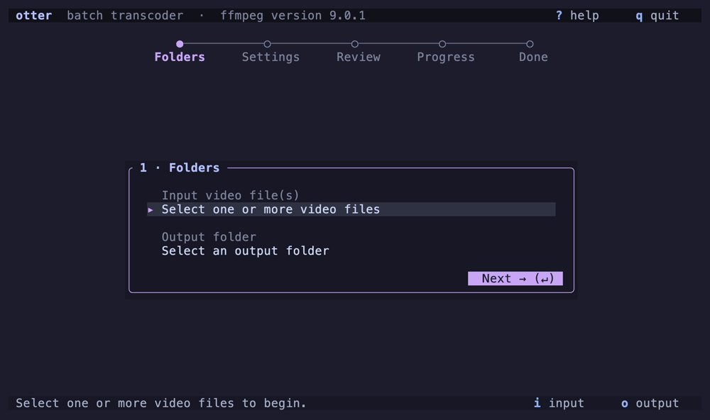

<p align="center">
  
</p>

<h1 align="center">otter</h1>

<p align="center">
  <a href="README.md"><kbd>English</kbd></a>
  <a href="README.zh-CN.md"><kbd>简体中文</kbd></a>
</p>

在 macOS 的终端界面中配置并运行 FFmpeg 转码。

<p align="center">
  
</p>

otter 内置文件选择器，可选择一个或多个输入文件。你可以选择兼容的容器和编解码器，控制分辨率与比特率，检查实际命令，并在同一个终端界面中查看转换进度。

## 功能

- 支持单个或多个文件，整批文件共用一套设置
- 批量运行时显示每个文件的状态，结束后显示逐文件摘要
- 内置终端文件选择器，可选择视频文件和目标文件夹，由应用自身绘制，不使用原生对话框
- 支持 MP4、MOV、Matroska（MKV）和 WebM 输出
- 在容器兼容时支持 H.264、H.265、AV1 和 VP9 视频选项
- 在已安装的 FFmpeg 提供对应 encoder 时，使用 VideoToolbox 硬件编码 H.264 和 H.265
- 在容器兼容时支持 AAC、Opus、MP3 或禁用音频
- 提供原始分辨率、2160p、1440p、1080p、720p 和 480p 预设
- 使用各编解码器对应的恒定质量值提供视频质量预设
- 提供目标视频比特率预设和自定义值
- 提供音频比特率预设和自定义值
- 估算整批选择的输出大小。在目标比特率模式下，误差为几个百分点；在恒定质量模式下标记为 `(rough)`
- 执行前显示经过 shell 安全转义的命令预览
- 实时显示已处理时长、百分比、速度和最近的 FFmpeg 消息
- 支持安全取消并自动清理临时输出，同时停止批次中的剩余任务
- 拒绝覆盖已有输出文件

## 安装

### Homebrew

Homebrew 会安装预编译二进制文件及其 FFmpeg 依赖：

```sh
brew tap softmaxe/tap
brew install otter
```

使用 `brew update && brew upgrade otter` 更新。也可以不先 tap，直接安装：

```sh
brew install softmaxe/tap/otter
```

在交互式终端中直接运行 `otter`。

### 从源码安装

从源码构建需要 macOS、Rust 1.85 或更新版本、FFmpeg、FFprobe 和交互式终端。使用 Homebrew 安装构建及运行工具：

```sh
brew install rust ffmpeg
```

```sh
cargo build --release
./target/release/otter
```

开发时运行：

```sh
cargo run
```

应用必须直接在交互式终端中运行，不支持重定向 stdin 或 stdout。

otter 会搜索 `PATH`、`/opt/homebrew/bin` 和 `/usr/local/bin`。可以通过环境变量指定自定义二进制文件位置：

```sh
OTTER_FFMPEG=/custom/path/ffmpeg \
OTTER_FFPROBE=/custom/path/ffprobe \
cargo run --release
```

## 操作流程

界面是一个五步向导。顶部圆点栏依次标出 **文件夹**、**设置**、**检查**、**进度** 和 **完成**。当前步骤显示在一张卡片中，进入下一步的按钮位于卡片底部。

1. 在 **文件夹** 步骤中按 `i`，选择一个或多个输入视频文件。Otter 会使用 FFprobe 探测每个已选文件。
2. 按 `o` 选择具体的目标文件夹。每个输入文件都会在该文件夹中得到一个派生的输出文件。
3. 在 **设置** 步骤中，使用 `Tab`、`Shift-Tab`、方向键或 `h`/`j`/`k`/`l` 依次调整容器、编解码器、分辨率、码率控制和比特率细节。
4. 按 `Enter` 或 `Review →` 按钮进入 **检查** 步骤。这里会显示实际的 FFmpeg 命令，以及批次将写入的文件列表。按 `Start →` 开始转换。
5. 在 **进度** 步骤查看进度和最近的 FFmpeg 消息。**完成** 步骤会报告结果；批量任务会逐文件显示一行结果。

一次只运行一个转换任务。批量任务会依次处理文件，因为 FFmpeg 在一次编码中已经会使用整台机器的资源。

整个界面都支持鼠标。将指针移到行、按钮、标题芯片、状态芯片或选择器列表项上即可高亮。悬停状态与键盘焦点互不影响。左键点击设置或卡片按钮；滚轮或右键可向前或向后切换设置值；点击标题栏或状态栏芯片可触发芯片所标出的按键。在文件选择器中，单击左键高亮一行，双击确认，滚轮只滚动列表，不改变选中行。

## 文件选择器

输入和输出选择器由应用自行绘制，不使用原生对话框，因此在各平台上的行为一致。选择器是一张模态卡片：顶部显示当前访问的文件夹，中间是列表，底部一行依次放置 `Cancel (esc)`、`Parent (←)` 和当前模式对应的操作按钮。

| 按键 | 操作 |
| --- | --- |
| `Up` / `Down` 或 `k` / `j` | 在行之间移动 |
| `Enter` | 打开高亮的文件夹，或选择高亮的输入文件 |
| `Space` | 添加或移除高亮的输入文件 |
| `s` | 确认已选输入文件，或使用当前输出文件夹 |
| `Tab` | 聚焦文件名输入框，供旧版输出文件模式使用 |
| `h` / `Left` / `Backspace` | 前往上级文件夹 |
| `g` | 前往主目录 |
| `.` | 切换隐藏文件显示 |
| `Esc` | 关闭选择器且不作选择 |

输入选择器用于选择具体文件，支持用 `Space` 多选，并把每个已选路径传给 FFprobe。选择器不会根据扩展名猜测文件是否为视频。输出选择器始终选择目录，即使只找到一个输入文件也是如此。

## 批量转换

每个已选文件按选择顺序使用同一套设置转换。

- 每个输出文件都命名为 `<source name>-transcode.<extension>`，并放在所选文件夹内。
- 如果 ffprobe 无法读取某个文件，该文件会阻止批次运行，直到从选择中移除。应用不会静默跳过它。
- 如果两个输入文件会产生同名输出，应用会在开始任何任务前拒绝运行。
- 某个文件转换失败不会阻止后续文件。结果界面会列出每个文件及其结果。
- 取消操作会停止正在运行的转换，并保持排队文件不变。

## 键盘参考

### 文件夹

| 按键 | 操作 |
| --- | --- |
| `Tab` / `Down` | 从输入视频文件移动到输出文件夹，再移动到 Next |
| `Up` / `Shift-Tab` | 在输入、输出和 Next 控件之间向后移动 |
| `Enter` / `i` | 选择输入视频文件 |
| `a` | 添加更多输入视频文件 |
| `c` | 清空已选输入视频文件 |
| `r` | 替换已选输入视频文件 |
| `o` | 选择输出文件夹 |
| `?` | 显示键盘帮助 |
| `q` | 退出 |

### 设置

| 按键 | 操作 |
| --- | --- |
| `Tab` / `Shift-Tab` | 在设置项之间移动 |
| `Up` / `Down` 或 `k` / `j` | 在设置项之间移动 |
| `Left` / `Right` 或 `h` / `l` | 更改选中值 |
| `r` | 再次探测已选输入文件 |
| `Enter` | 编辑比特率或打开检查步骤 |
| `?` | 显示键盘帮助 |
| `q` | 退出 |

### 检查

| 按键 | 操作 |
| --- | --- |
| `Up` / `Down`、`PageUp` / `PageDown`、`Home` / `End` | 滚动完整命令和文件映射列表 |
| `Enter` / `y` | 开始转换 |
| `Esc` / `n` | 返回设置 |
| `q` | 退出 |

### 进度

| 按键 | 操作 |
| --- | --- |
| `Up` / `Down`、`PageUp` / `PageDown`、`Home` / `End` | 滚动 FFmpeg 消息；按 `End` 恢复跟随最新输出 |
| `x` / `Ctrl-C` | 打开取消确认 |
| `q` / `Esc` | 打开取消确认 |
| `y` / `Enter` | 确认取消，并停止批次中的剩余任务 |
| `n` / `Esc` | 继续运行 |

### 完成

| 按键 | 操作 |
| --- | --- |
| `Enter` / `Esc` | 返回文件夹步骤 |
| `?` | 显示键盘帮助 |
| `q` | 退出 |

## 支持的组合

界面会阻止已知不兼容的容器和编解码器组合。

| 容器 | 视频编解码器 | 音频编解码器 |
| --- | --- | --- |
| MP4 | H.264 (CPU/GPU)、H.265 (CPU/GPU)、AV1 | AAC、None |
| MOV | H.264 (CPU/GPU)、H.265 (CPU/GPU)、AV1 | AAC、None |
| Matroska (MKV) | H.264 (CPU/GPU)、H.265 (CPU/GPU)、AV1、VP9 | AAC、Opus、MP3、None |
| WebM | AV1、VP9 | Opus、None |

只有检测到的 FFmpeg 构建中提供对应 encoder 时，才能选择该编解码器。软件 encoder 包括 `libx264`、`libx265`、`libsvtav1`、`libvpx-vp9`、`aac`、`libopus` 和 `libmp3lame`。硬件 encoder 是 `h264_videotoolbox` 和 `hevc_videotoolbox`。

## 硬件加速

选择 `VideoToolbox, GPU` 编解码器会把编码任务从 CPU 移到 Apple media engine，并添加 `-hwaccel videotoolbox`，使解码也在那里运行。对于 media engine 无法读取的格式，FFmpeg 会改用软件解码。

以下结果在 M2 Pro 和 FFmpeg 8.1.2 上测得，测试素材是 30 秒的 1080p30 视频片段，预设按质量匹配：

| Encoder | 实际耗时 | CPU 时间 | 输出大小 | VMAF |
| --- | ---: | ---: | ---: | ---: |
| `libx264` medium, CRF 23 | 5.06 s | 52.7 s | 25.8 MB | 96.43 |
| `h264_videotoolbox`, q 60 | 4.50 s | 4.8 s | 27.3 MB | 96.75 |
| `libx265` medium, CRF 26 | 13.29 s | 104.8 s | 20.2 MB | 94.88 |
| `hevc_videotoolbox`, q 55 | 4.83 s | 4.8 s | 22.8 MB | 95.27 |

H.265 的硬件编码优势明确。速度约为 2.7 倍，CPU 时间约少 22 倍。H.264 的实际耗时与多核快速运行 `libx264` 接近，但只使用约十分之一的 CPU，因此机器仍能流畅响应，耗电也更少。软件 encoder 在低比特率下仍有更高的压缩效率。如果文件大小比时间更重要，请使用 `libx264` 或 `libx265`。

VideoToolbox encoder 只能使用硬件。任务会立即失败，不会回退到缓慢的软件 VideoToolbox 路径。

## 码率控制

### 恒定质量

质量模式提供 High、Balanced 和 Small file 预设。软件 encoder 使用 CRF，值越低，质量越高，文件越大。VideoToolbox 没有 CRF，而是使用方向相反的 `-q:v` 标度，值越高，质量越高。硬件值已经使用 VMAF 对照软件预设校准，使两条路径得到相近的质量。

| 编解码器 | 参数 | High | Balanced | Small file |
| --- | --- | ---: | ---: | ---: |
| H.264 (libx264) | `-crf` | 18 | 23 | 28 |
| H.264 (VideoToolbox) | `-q:v` | 70 | 60 | 47 |
| H.265 (libx265) | `-crf` | 20 | 26 | 30 |
| H.265 (VideoToolbox) | `-q:v` | 65 | 55 | 47 |
| AV1 | `-crf` | 28 | 35 | 42 |
| VP9 | `-crf` | 24 | 32 | 40 |

质量模式不设置目标视频比特率，但 VP9 必须使用 `-b:v 0`。

### 目标比特率

视频比特率预设为 1000、2500、5000、8000、12000 和 20000 kbps。自定义视频比特率必须在 100 到 200000 kbps 之间。

音频比特率预设为 64、96、128、160、192、256 和 320 kbps。自定义音频比特率必须在 32 到 512 kbps 之间。如果输入文件没有音频流，或 Audio codec 设为 None，音频比特率会被禁用。

## 分辨率行为

分辨率预设定义输出画布的最大尺寸。缩放操作会：

- 保持源文件的宽高比；
- 不放大尺寸小于所选预设的源文件；
- 生成能被二整除的尺寸，以兼容更多编解码器。

选择 Source 可保留原始尺寸。

## 输出安全

otter 不会通过 shell 执行预览命令。程序参数始终是独立的值，因此路径中的空格、引号、Unicode 和 shell 元字符不会被当作 shell 语法解释。

应用还会：

- 拒绝与任何已选输入相同的输出路径；
- 拒绝覆盖已有的最终输出；
- 在目标文件旁由应用拥有的 `.otter-*` 目录中写入临时文件；
- 仅在 FFmpeg 成功后，将完成的临时文件原子重命名为最终路径。

任务失败或取消后，应用会删除自己创建的临时目录。取消时会先向 FFmpeg 发送 `SIGINT`，仅当 FFmpeg 在约三秒内没有退出时才强制停止。

## 限制

转换任务逐个运行，输入必须是本地文件。应用不包括：

- 并行编码，或在应用重启后仍保留的队列；
- 同一批次内的逐文件设置；
- stream copy；
- 字幕、附件或数据流复制；
- 自定义 FFmpeg 参数；
- 质量预设以外的硬件 encoder 调整；
- 保存用户预设；
- 自动替换已有输出。

应用使用第一个视频流，以及可选的第一个音频流。

## 开发和验证

运行格式检查、lint、单元测试、FFmpeg 集成测试和 release 构建：

```sh
cargo fmt --check
cargo clippy --all-targets --all-features -- -D warnings
cargo test
cargo build --release
```

集成测试会使用 FFmpeg 生成临时的合成媒体。缺少 FFmpeg、FFprobe、`libx264` 或 AAC 时，测试会跳过，且不会访问用户的媒体文件。缺少硬件 encoder 时，VideoToolbox 测试也会跳过。

## 发布版本

手动运行 **Release** workflow 可以测试两种 macOS 架构的打包流程，但不会创建 GitHub Release。正式发布前先更新 `Cargo.toml` 中的 `package.version`，再创建并推送一致的三段式版本 tag：

```sh
git tag v1.0.0
git push origin v1.0.0
```

workflow 会测试并打包 Apple silicon 和 Intel 原生二进制文件，发布两个压缩包及 `SHA256SUMS`，然后更新 `softmaxe/homebrew-tap` 中的 `Formula/otter.rb`。`bump-tap` job 需要名为 `OTTER_HOMEBREW_TAP_UPDATER` 的 Actions secret，并且该 token 必须有目标仓库的写入权限。
